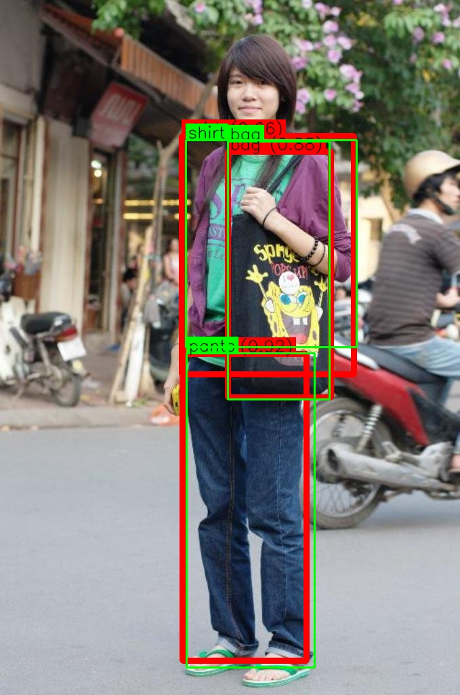
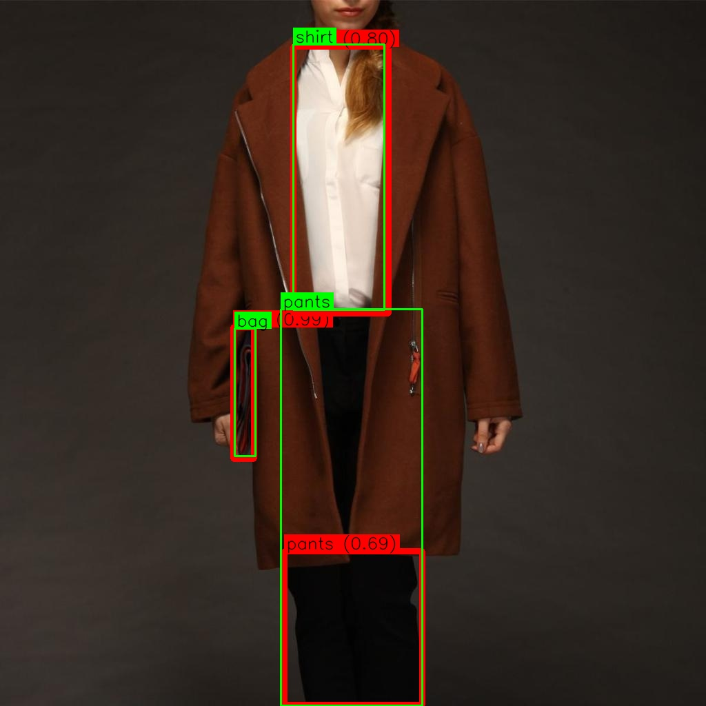

# Adaptive Vision-Language Detector (AViD) 🦖

[](https://opensource.org/licenses/MIT)

A streamlined toolkit for fine-tuning state-of-the-art vision-language detection models with parameter-efficient adaptation. Built on Grounding DINO with LoRA support and EMA stabilization.

<div align="center">
  
   
</div>

## Key Features 🔑

AViD extends the powerful Grounding DINO framework by adding fine-tuning capabilities for image-to-text grounding. This functionality is critical for applications requiring precise alignment between textual descriptions and image regions.

For example, when the model encounters a caption like "a cat on the sofa," it can accurately localize both the "cat" and the "sofa" in the corresponding image.

- **Fine-tuning Pipeline**: Complete workflow for fine-tuning Grounding DINO on custom datasets
- **Parameter-Efficient Training with LoRA**: Train just ~2% of parameters while maintaining performance
  - Uses rank-32 LoRA adapters by default (smaller ranks also available)
  - Significantly reduces storage requirements for fine-tuned models
- **EMA (Exponential Moving Average)**: Retains pre-trained knowledge during fine-tuning
- **Sample Dataset**: Includes fashion dataset subset for immediate experimentation
- **Optional Phrase-Based NMS**: Removes redundant boxes for the same objects

## Installation ⚙️

```bash
# Clone repository
git clone https://github.com/levy-tech-spark/AViD
cd AViD

# Install dependencies
pip install -r requirements.txt

# Install package (add CUDA flags if needed)
pip install -e .
```

**CUDA Configuration Tip**:  

For custom GPU setups, set architecture compatibility:

```bash
nvidia-smi --query-gpu=gpu_name,compute_cap --format=csv
export TORCH_CUDA_ARCH_LIST="<your-arch>"
export FORCE_CUDA=1
```

If you have an older GPU or if the architecture is not recognized automatically:

```bash
# Check if CUDA_HOME is set correctly
# e.g export CUDA_HOME=/usr/local/cuda
nvidia-smi --query-gpu=gpu_name,compute_cap --format=csv

# Add your GPU architecture capability from previous command
export TORCH_CUDA_ARCH_LIST="6.0;6.1;7.0;7.5;8.0;8.6" 
export FORCE_CUDA=1
```

## Quick Start 🚦

1. **Get Sample Dataset**

```bash
gdown https://drive.google.com/uc?id=1D2qphEE98Dloo3fUURRnsxaIRw076ZXX
unzip fashion_dataset_subset.zip -d multimodal-data
```

2. **Start Training (LoRA Example)**

```bash
python train.py --config configs/train_config.yaml
```

3. **Evaluate Model**

```bash
python test.py --config configs/test_config.yaml
```

## Configuration Guide ⚙️

Customize training through YAML configs:

```yaml
# Example config snippet
training:
  num_epochs: 200
  learning_rate: 1e-4
  use_lora: true
  lora_rank: 32

data:
  batch_size: 8
  num_workers: 4
```

## Performance Highlights 📈

| Metric          | Baseline | Fine-Tuned |
|-----------------|----------|------------|
| mAP@0.5 (Shirt) | 0.62     | 0.89       |
| mAP@0.5 (Pants) | 0.58     | 0.85       |
| mAP@0.5 (Bag)   | 0.65     | 0.91       |

## Advanced Features 🧪

**Parameter-Efficient LoRA**

```python
# Enable in config
training:
  use_lora: true
  lora_rank: 16  # Reduce for higher compression
```

**EMA Stabilization**

```python
# Automatic in training loop
model = ModelEMA(model, decay=0.999)
```

**Interactive Demo**

```bash
python demo/gradio_app.py --share
```

## Contribution & Roadmap 🤝

[](CONTRIBUTING.md)

**Current Priorities:**

- [x] Add LoRA for efficient fine-tuning
- [ ] Add comprehensive model evaluation metrics
- [ ] Implement techniques to prevent catastrophic forgetting
- [ ] Add auxiliary losses as described in the original paper
- [ ] Quantization support
- [ ] Distributed training
- [ ] HuggingFace integration

**How to Contribute:**

1. Fork the repository
2. Create feature branch (`git checkout -b feature/amazing-feature`)
3. Commit changes (`git commit -m 'Add amazing feature'`)
4. Push to branch (`git push origin feature/amazing-feature`)
5. Open Pull Request

## License 📜

This project is licensed under the MIT License - see the [LICENSE](LICENSE) file for details.
